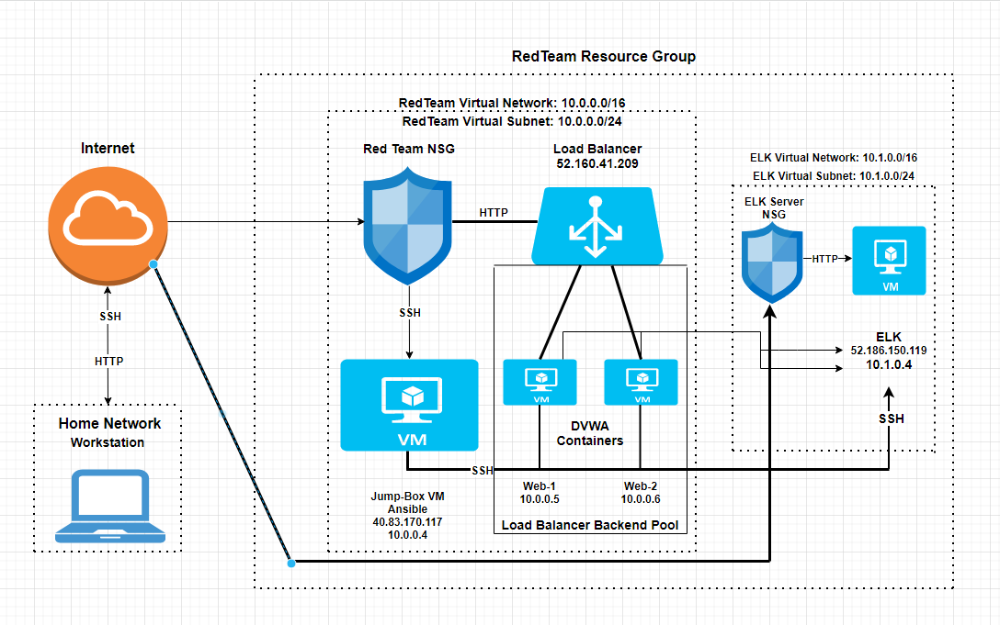

# Project1ELKserver
This repository contains all required deliverables for the ELK server project.
## Automated ELK Stack Deployment

The files in this repository were used to configure the network depicted below.

These files have been tested and used to generate a live ELK deployment on Azure. They can be used to either recreate the entire deployment pictured above. Alternatively, select portions of the playbook file may be used to install only certain pieces of it, such as Filebeat.

  - [install-elk.yml](Ansible/install-elk.yml)

This document contains the following details:
- Description of the Topology
- Access Policies
- ELK Configuration
  - Beats in Use
  - Machines Being Monitored
- How to Use the Ansible Build

### Description of the Topology

The main purpose of this network is to expose a load-balanced and monitored instance of DVWA, the D*mn Vulnerable Web Application.

Load balancing ensures that the application will be highly efficient, in addition to restricting traffic to the network.
- _Load balancers can provide helpful security techniques. They can help defend against deinal-of-service (DDoS) attacks by shifting attack traffic from the corporate server to a public cloud provider._
- _A jump box is a secure was for Security Administrators to connect to other servers or even certain untrusted environments._

Integrating an ELK server allows users to easily monitor the vulnerable VMs for changes to the data and system logs.
- _Filebeat monitors log files in locations that you specify during configuration._
- _Metricbeat helps monitor servers by collecting metrics from the system and services running._

The configuration details of each machine may be found below.
_Note: Use the [Markdown Table Generator](http://www.tablesgenerator.com/markdown_tables) to add/remove values from the table_.

| Name     | Function | IP Address | Operating System |
|----------|----------|------------|------------------|
| Jump Box | Gateway  | 10.0.0.1   | Linux            |
| Web 1    | Host     | 10.0.0.5   | Linux            |
| Web 2    | Host     | 10.0.0.6   | Linux            |
| ELK      | ELK Host | 10.1.0.0   | Linux            |

### Access Policies

The machines on the internal network are not exposed to the public Internet. 

Only the ELK machine can accept connections from the Internet. Access to this machine is only allowed from the following IP addresses:
- _Workstation IP_

Machines within the network can only be accessed by jump box.
- _The jump box virtual machine is allowed to connect via SSH to the ELK server. The IP is 40.83.170.117._

A summary of the access policies in place can be found in the table below.

| Name     | Publicly Accessible | Allowed IP Addresses |
|----------|---------------------|----------------------|
| Jump Box | No                  | Workstation IP       |
| Web 1&2  | No                  | 10.0.0.1             |
| ELK      | No                  | 10.0.0.1/WS IP       |

### Elk Configuration

Ansible was used to automate configuration of the ELK machine. No configuration was performed manually, which is advantageous because...
- _Ansible is easy to learn and self-documenting. It is also easy to read which is an important part of automation._

The playbook implements the following tasks:
- _First, we will install docker.io to the VM. This will allow us to then download the image needed for the ELK container._
- _Next, we need to install pip3 to be able to download Docker python modules._
- _Then, we will finally install the ELK docker container to the desired VM.

The following screenshot displays the result of running `docker ps` after successfully configuring the ELK instance.

!(Images/install_elk_output.png)

### Target Machines & Beats
This ELK server is configured to monitor the following machines:
- _10.0.0.5 (the Web-1 VM) and 10.0.0.6 (the Web-2 VM)_

We have installed the following Beats on these machines:
- _Filebeat and Metricbeat_

These Beats allow us to collect the following information from each machine:
- _TODO: In 1-2 sentences, explain what kind of data each beat collects, and provide 1 example of what you expect to see. E.g., `Winlogbeat` collects Windows logs, which we use to track user logon events, etc._

### Using the Playbook
In order to use the playbook, you will need to have an Ansible control node already configured. Assuming you have such a control node provisioned: 

SSH into the control node and follow the steps below:
- Copy the install ELK playbook file to /etc/ansible.
- Update the ansible configuration file to include an ELK group with your ELK server IP, and a webservers folder with your Web server IP addresses for the Filebeat/Metricbeat installation.
- Run the playbook, and navigate to http://[your ELK server public IP]:5601/app/kibana to check that the installation worked as expected._

